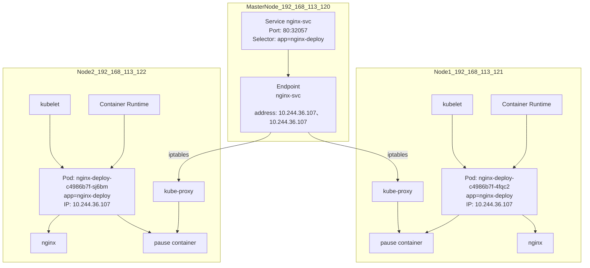

# 服务发现

K8s 服务发现是K8s 集群中的核心功能，用于实现 Pod 之间的服务发现和通信。主要有两种实现方式：service 和 ingress。

## Service

+ Service 是一种抽象，用来定义一组 Pod 的访问方式。
+ 它提供了一种稳定的访问方式，可以通过 Service 的 ClusterIP、NodePort 或者 LoadBalancer 类型来访问后端 Pod。
+ Service 通常用于在应用内部进行服务发现和通信，或者对外暴露服务。




```yaml
apiVersion: v1
kind: Service
metadata:
  name: nginx-svc
spec:
  type: NodePort
  selector:
    app: nginx-deploy
  ports:
  - protocol: TCP
    port: 80
    targetPort: 80
```

### **type**

1. **ClusterIP**（集群内部IP）：这是默认的 Service 类型。它将为服务分配一个集群内部的虚拟 IP 地址，并且仅在集群内部可访问。其他 Pod 可以通过该 IP 地址访问服务，但是该 IP 地址对集群外部不可见。
2. **NodePort**（节点端口）：NodePort 类型的 Service 会在每个节点上选择一个端口，并将此端口映射到 Service 的后端 Pod。此外，还会在集群的所有节点上公开此端口，使得集群外部可以通过 **`<NodeIP>`:NodePort** 访问该服务。
3. **LoadBalancer**（负载均衡器）：LoadBalancer 类型的 Service 会使用云服务提供商（如 AWS、Azure、GCP 等）提供的负载均衡器来公开服务。负载均衡器会为 Service 提供一个唯一的外部 IP 地址，并通过此 IP 地址将流量路由到 Service 的后端 Pod。这样，您可以通过负载均衡器的 IP 地址访问服务。
4. **ExternalName**（外部名称）：ExternalName 类型的 Service 并不会分配 ClusterIP 或 NodePort。它只会为服务分配一个外部名称，并将此外部名称映射到外部服务的 DNS 记录。这个外部服务可以是集群外部的任何服务，例如外部数据库或者其他外部服务。

## Ingress

> [官方文档](https://github.com/kubernetes/ingress-nginx?tab=readme-ov-file#supported-versions-table)
>
> 注意和k8s集群的版本对应关系
>
> https如果是自签的，需要单独信任
>
> Ingress属于七层应用，端口属于四层，非七层协议，还是用NodePort

+ Ingress 是 Kubernetes 中用于管理 HTTP 和 HTTPS 流量的 API 对象。
+ 它允许外部流量进入 Kubernetes 集群，并在集群内部的 Service 之间进行路由和负载均衡。
+ Ingress 可以定义域名、路径和其他规则，根据这些规则将流量转发到不同的后端 Service。

```shell
helm repo add ingress-nginx https://kubernetes.github.io/ingress-nginx
helm repo update
# 指定版本号
# see https://github.com/kubernetes/ingress-nginx?tab=readme-ov-file#supported-versions-table

helm install ingress-nginx ingress-nginx/ingress-nginx \
  --namespace ingress-nginx --create-namespace \
  --version 4.3.0 \
  --set controller.image.tag="v1.6.4" \
  -f ingress-values.yaml

helm upgrade ingress-nginx ingress-nginx/ingress-nginx \
  -n ingress-nginx \
  -f ingress-values.yaml \
```

```yaml
controller:
  extraVolumes:
    - name: ingress-ca-cert
      configMap:
        name: ingress-ca-cert
  extraVolumeMounts:
    - name: ingress-ca-cert
      mountPath: /etc/ingress-ca-cert
      readOnly: true
  tcp:
    enabled: true  # 如果 chart 支持此开关，可以加上
  tcpServicesConfigMapNamespace: ingress-nginx
  tcpServicesConfigMapName: tcp-services
```

### 局域网

+ MetalLB：解决私有云测试部署验证问题

### 授权管理

```yaml
apiVersion: networking.k8s.io/v1
kind: Ingress
metadata:
  name: my-ingress
  namespace: ai-flow
  resourceVersion: '41949573'
  generation: 3
  creationTimestamp: '2025-07-01T02:51:30Z'
  labels:
    k8slens-edit-resource-version: v1
  annotations:
    kubectl.kubernetes.io/last-applied-configuration: >
      {"apiVersion":"networking.k8s.io/v1","kind":"Ingress","metadata":{"annotations":{},"name":"my-ingress","namespace":"ai-flow"},"spec":{"ingressClassName":"nginx","rules":[{"host":"dfdf.com","http":{"paths":[{"backend":{"service":{"name":"animal-pose-3-2","port":{"number":8080}}},"path":"/","pathType":"Prefix"}]}},{"host":"dsds.com","http":{"paths":[{"backend":{"service":{"name":"animal-pose-3-2","port":{"number":8888}}},"path":"/","pathType":"Prefix"}]}}]}}
    nginx.ingress.kubernetes.io/auth-response-headers: X-Auth-Request-User, X-Auth-Request-Email
    nginx.ingress.kubernetes.io/auth-signin: >-
      http://oauth.abc.com:9003/oauth2/start?rd=$scheme://$host$request_uri
    nginx.ingress.kubernetes.io/auth-url: http://oauth.abc.com:9003/oauth2/auth
  selfLink: /apis/networking.k8s.io/v1/namespaces/ai-flow/ingresses/my-ingress
status:
  loadBalancer:  # 
    ingress:
      - ip: 10.1.72.2  # 私有云通过MetalLB解决
spec:
  ingressClassName: nginx
  rules:
    - host: 8080.abc.com
      http:
        paths:
          - path: /
            pathType: Prefix
            backend:
              service:
                name: ffddsssss-1-1270
                port:
                  number: 8080
    - host: 8888.abc.com
      http:
        paths:
          - path: /
            pathType: Prefix
            backend:
              service:
                name: ffddsssss-1-1270
                port:
                  number: 8888

```

## CoreDNS

提供集群内部的本地域名映射解析能力

### 集群内自定义域名

1. 修改coredns配置

```yaml
apiVersion: v1
data:
  Corefile: |
    .:53 {
        errors
        health {
           lameduck 5s
        }
        ready
        kubernetes cluster.local in-addr.arpa ip6.arpa {
           pods insecure
           fallthrough in-addr.arpa ip6.arpa
           ttl 30
        }
        # look 
        hosts {
           10.1.72.80 oauth.abc.com
           fallthrough
        }
        prometheus :9153
        forward . /etc/resolv.conf {
           max_concurrent 1000
        }
        cache 30
        loop
        reload
        loadbalance
    }
kind: ConfigMap
metadata:
  name: coredns
  namespace: kube-system
```

1. 给需要绑定自定义域名的 pod / deploy 添加

```shell
kubectl rollout restart deployment coredns -n kube-system
```

```yaml
spec:
  template:
    spec:
      hostAliases:
        - ip: "10.1.72.80"
          hostnames:
            - "oauth.abc.com"
```
