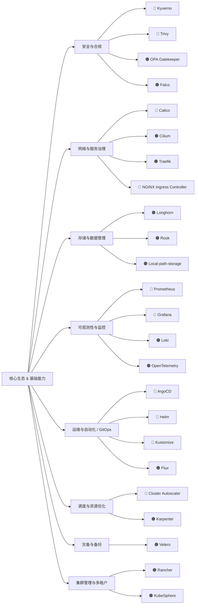
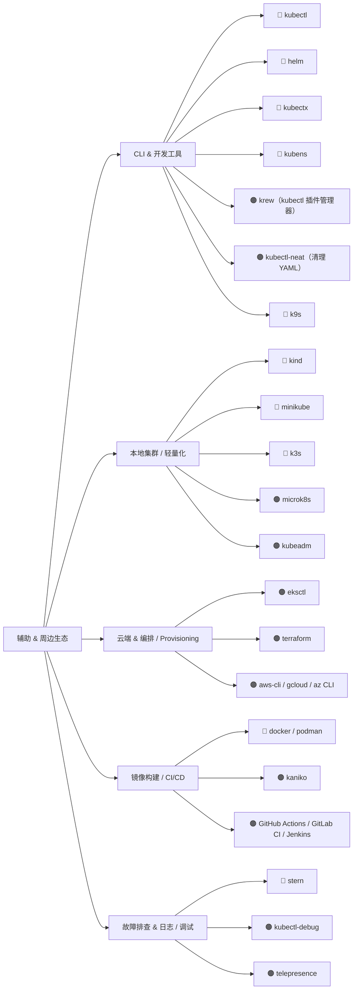

# Kubernetes

**Kubernetes** 一个用于**自动化容器化应用部署、扩缩和管理的开源系统**。它最初由 Google 设计开发，现在由 Cloud Native Computing Foundation（CNCF）维护。

---

## ✅ 简单理解

Kubernetes 就像一个“**容器编排系统**”，它可以自动帮你：

* 启动应用容器
* 保证应用高可用（自动重启、自动迁移）
* 自动扩容缩容
* 发布更新时实现“滚动升级”不影响服务
* 应对故障（自动修复 Pod）

---

## 📦 关键概念

| 概念                     | 简单解释                          |
| ---------------------- | ----------------------------- |
| **Pod**                | Kubernetes 中最小的部署单位，通常运行一个容器。 |
| **Node**               | 工作节点，实际运行容器的服务器（虚拟或物理）。       |
| **Cluster**            | 整个 Kubernetes 系统，由多个 Node 组成。 |
| **Deployment**         | 控制 Pod 的部署和升级策略。              |
| **Service**            | 暴露 Pod 的访问方式，提供负载均衡能力。        |
| **Ingress**            | 通过域名或路径访问服务的入口。               |
| **ConfigMap / Secret** | 配置管理和敏感信息（如密码）的管理方式。          |

---

## 🌐 为什么用 Kubernetes？

* 实现**应用高可用**
* 管理**大规模容器集群**
* 快速部署、更新、回滚服务
* 更好地利用资源（支持自动调度）

---

## 📌 举例

假设你有一个 Web 应用放在 Docker 容器中，你可以通过 K8s：

* 定义一个 Deployment，自动运行 3 个副本
* 用 Service 暴露访问接口
* 如果一个副本挂了，K8s 自动再起一个

## 🗺️ 学习地图

