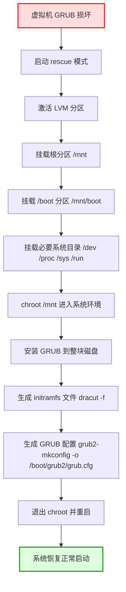

# QA

## SSH升级

> 直接最新版本
>
> 为了防止过程出现意外，先安装telnet远程工具
>
> 然后按顺序安装升级
>
> 1. zlib
> 2. openssl
> 3. openssh
>

### telnet

```shell
yum -y install telnet-server xinetd
 
echo "service telnet
{
    flags        = REUSE
    socket_type    = stream        
    wait        = no
    user        = root
    server        = /usr/sbin/in.telnetd
    log_on_failure    += USERID
    disable        = no
}" > /etc/xinetd.d/telnet 


systemctl enable xinetd --now
# 默认端口22
```

一般来说不允许root用户登录，所以还需要创建一个其他用户用来登录

```shell
useradd temp
passwd temp

yum -y install zlib* pam-* gcc openssl-devel gcc-c++ make
```

### zlib

[官网](https://www.zlib.net/)

```shell
cd /usr/local/src/
tar zxvf zlib-1.3.tar.gz
cd  zlib-1.3
yum install gcc gcc-c++ make -y 
./configure --prefix=/usr/local/zlib
make && make install
```

### openssl

[官网](https://www.openssl.org/)

```shell
cd /usr/local/src/
#解压文件
tar zxvf openssl-3.2.0.tar.gz
cd openssl-3.2.0
 
#安装相应的前置依赖
yum install -y perl-CPAN perl-ExtUtils-CBuilder perl-ExtUtils-MakeMaker 
 
./config  --prefix=/usr/local/ssl  --shared
make && make install

#新注：编译好后需链接相关目录
mv -f /usr/bin/openssl /usr/bin/openssl.bak
ln -s /usr/local/ssl/bin/openssl /usr/bin/openssl
ln -s /usr/local/ssl/include/openssl /usr/include/openssl
echo "/usr/local/ssl/lib" >> /etc/ld.so.conf.d/ssl.conf

#查看链接
ldconfig -v
#查看版本
openssl version -a

#路径写入etc/ld.so.conf
echo '/usr/local/ssl/lib64' >> /etc/ld.so.conf
```

### openssh

[官网](https://www.openssh.com/)

```shell
#备份ssh配置文件
cp -p /etc/ssh/sshd_config /etc/ssh/sshd_config.bak
cp -p /usr/sbin/sshd /usr/sbin/sshd.bak
cp -p /usr/bin/ssh /usr/bin/ssh.bak
cp -p /usr/bin/ssh-keygen /usr/bin/ssh-keygen.bak
cp -p /etc/ssh/ssh_host_ecdsa_key.pub /etc/ssh/ssh_host_ecdsa_key.pub.bak
 
 
#停止ssh服务
systemctl stop sshd
#备份ssh文件
cp -r /etc/ssh /etc/ssh.old 
 
 
 
#查询原有ssh包并卸载
rpm -qa | grep openssh
openssh-7.4p1-23.el7_9.x86_64
openssh-clients-7.4p1-23.el7_9.x86_64
openssh-server-7.4p1-23.el7_9.x86_64
#根据查询结果，卸载原有OpenSSH包
yum  remove openssh-7.4p1-23.el7_9.x86_64
 
#再次查看已经没有了
rpm -qa | grep openssh

```

```shell
 
cd /usr/local/src/
#解压
tar zxvf  openssh-9.5p1.tar.gz
cd openssh-9.5p1
#编译安装openssh 指明zlib路径和ssl路径
./configure --prefix=/usr/local/openssh- --with-zlib=/usr/local/zlib --with-ssl-dir=/usr/local/ssl
make && make install 
 
#ssh允许root登录、需要密码进行验证
echo 'PermitRootLogin yes' >>/usr/local/openssh/etc/sshd_config
echo 'PubkeyAuthentication yes' >>/usr/local/openssh/etc/sshd_config
echo 'PasswordAuthentication yes' >>/usr/local/openssh/etc/sshd_config
 
#将编译安装的新配置文件   拷贝到原路径下
cp /usr/local/openssh/etc/sshd_config /etc/ssh/sshd_config
cp /usr/local/openssh/sbin/sshd /usr/sbin/sshd
cp /usr/local/openssh/bin/ssh /usr/bin/ssh
cp /usr/local/openssh/bin/ssh-keygen /usr/bin/ssh-keygen
cp /usr/local/openssh/etc/ssh_host_ecdsa_key.pub /etc/ssh/ssh_host_ecdsa_key.pub
 
 
#拷贝启动脚本
cp -p contrib/redhat/sshd.init /etc/init.d/sshd
#给sshd添加可执行权限
chmod +x /etc/init.d/sshd
systemctl enable sshd --now
ssh -V
```

telnet服务禁用：略

## glibc升级

```shell
sudo yum groupinstall "Development Tools" -y
sudo yum install gcc-c++ glibc-devel -y
```

1. 查看依赖

```shell
wget https://mirrors.aliyun.com/gnu/glibc/glibc-2.31.tar.gz
tar -zxvf glibc-2.31.tar.gz
cd glibc-2.31/
cat INSTALL | grep -E  "newer|later"
		   * GNU 'make' 4.0 or newer
		   * GCC 6.2 or newer
			 building the GNU C Library, as newer compilers usually produce
		   * GNU 'binutils' 2.25 or later
		   * GNU 'texinfo' 4.7 or later
		   * GNU 'bison' 2.7 or later
		   * GNU 'sed' 3.02 or newer
		   * Python 3.4 or later
		   * GDB 7.8 or later with support for Python 2.7/3.4 or later
		   * GNU 'gettext' 0.10.36 or later
```

2. 升级gcc

```shell
wget https://mirrors.aliyun.com/gnu/gcc/gcc-9.3.0/gcc-9.3.0.tar.gz
tar axf gcc-9.3.0.tar.gz
cd gcc-9.3.0
./contrib/download_prerequisites
cat /proc/cpuinfo| grep "processor"| wc -l
mkdir build
cd build
../configure --enable-checking=release --enable-language=c,c++ --disable-multilib --prefix=/usr
make -j32
make install
gcc -v
```

3. 升级make

```shell
wget https://mirrors.aliyun.com/gnu/make/make-4.3.tar.gz
tar axf make-4.3.tar.gz
cd make-4.3
mkdir build
cd build
../configure --prefix=/usr && make -j32 && make install
make -v

```

4. 升级gblic

```shell
wget https://mirrors.aliyun.com/gnu/glibc/glibc-2.31.tar.gz
cd glibc-2.31/
mkdir build
cd build
../configure --prefix=/usr --disable-profile --enable-add-ons --with-headers=/usr/include --with-binutils=/usr/bin --disable-sanity-checks --disable-werror
make -j32
make install
make localedata/install-locales
ldd --version
ll /lib64/libc.so.6
```

## Docker 

### 代理

1. docker单独配置

创建文件

```shell
sudo mkdir -p /etc/systemd/system/docker.service.d
sudo vim /etc/systemd/system/docker.service.d/http-proxy.conf
```

文件内容

```yaml
[Service]
Environment="HTTP_PROXY=http://10.1.72.80:7897/"
Environment="HTTPS_PROXY=http://10.1.72.80:7897/"
Environment="NO_PROXY=localhost,127.0.0.1,::1,172.29.0.0/16"
```

重启 Docker

```shell
sudo systemctl daemon-reload
sudo systemctl restart docker
```

2. 命令单独代理

```shell
https_proxy="http://ip:port" curl -i baidu.com
```

3. docker代理掉线的情况下，需要移除这个配置文件才能正常pull，所以随便映射个端口给docker用

```yaml
version: '3'

services:
  tinyproxy:
    image: dannydirect/tinyproxy
    container_name: tinyproxy
    ports:
      - "7890:8888"
    networks:
      - net
    command: ANY
    restart: always
networks:
  net:
    external: true
```

4. 环境变量配置

```bash
export HTTP_PROXY=http://172.19.1.16:7890
export HTTPS_PROXY=http://172.19.1.16:7890
export NO_PROXY="172.0.0.0/24,10.0.0.0/24,localhost,127.0.0.1,.svc,.cluster.local"
```

### 时区问题

#### Ubuntu && Debian

```dockerfile

ENV DEBIAN_FRONTEND noninteractive

RUN apt-get update && apt-get install -y \
    tzdata \
 && rm -rf /var/lib/apt/lists/*

RUN  ln -fs /usr/share/zoneinfo/Asia/Shanghai /etc/localtime \
    && dpkg-reconfigure --frontend noninteractive tzdata

```

```shell
docker run -it iamge date
```

### 端口封禁

```shell
#只允许10.108.11.178访问容器的1521端口
iptables -I DOCKER-USER  !  -s  10.108.11.178  -p tcp --dport 1521 -j DROP
iptables -nL
```

```shell
#永久保存iptables规则
yum install iptables -y && yum install iptables-services -y
systemctl start iptables.service && systemctl enable iptables.service
service iptables save
```

然后添加docker容器内部的访权限

```shell
# 获取网卡的subnet
docker network inspect bridge |grep Subnet
iptables -I DOCKER-USER -p tcp -s 172.17.0.0/16 -j ACCEPT
```

### 给容器内部添加静态hosts

```yaml
extra_hosts:
  - "somehost:50.31.209.229"
```

### 容器大小控制

#### 多阶段构建

```dockerfile
# 第一阶段：构建应用
FROM golang:1.20-alpine AS builder

# 设置工作目录
WORKDIR /app

# 将源代码复制到容器中
COPY . .

# 下载依赖并构建应用程序
RUN go mod tidy && go build -o myapp .

# 第二阶段：生成最终镜像
FROM alpine:3.18

# 创建应用运行所需的目录
WORKDIR /app

# 从构建阶段复制生成的二进制文件到当前镜像
COPY --from=builder /app/myapp .

# 运行应用
CMD ["./myapp"]

```

## swap

### `swappiness`

`swappiness` 参数控制了内核将内存中的数据移到 swap 空间的频率。这个参数的值介于 0 到 100 之间：

+ **0** 表示尽可能避免使用 swap，将更多数据保存在内存中。
+ **100** 表示更频繁地使用 swap，即使内存尚未耗尽。

```shell
# 临时更改（直到系统重启为止）
sudo sysctl vm.swappiness=10

# 永久更改
echo "vm.swappiness=10" | sudo tee -a /etc/sysctl.conf
sudo sysctl -p
# 查看当前值
cat /proc/sys/vm/swappiness
```

### 开启关闭

如果你想将现有 swap 分区或文件中的数据重新加载到内存中，可以通过以下步骤进行：

1. **关闭 Swap**：

```plain
sudo swapoff -a
```

2. **检查 Swap 内容是否写入 RAM**： `swapoff` 命令会尝试将 swap 中的数据重新加载到 RAM 中。你可以使用 `free -m` 来检查 swap 是否已清空，内存使用是否有所增加。
3. **重新启用 Swap**（如果需要）：

```plain
sudo swapon -a
```

## OOM

### 1. **查看系统日志文件**

CentOS 系统的日志通常保存在 `/var/log/` 目录下。你可以查看相关的日志文件来获取有关内存不足和系统重启的详细信息。

+ **dmesg 日志**： `dmesg` 命令用于显示内核的环形缓冲区日志，包含内核启动过程中的信息，包括内存错误或 OOM（Out-Of-Memory）相关的信息。

```plain
dmesg | grep -i oom 
```

这将搜索是否有 OOM killer 被触发的记录，如果系统因内存不足自动终止进程或重启，通常会有类似的日志。

+ **/var/log/messages**： 该文件包含了系统的各种日志，包括内存错误和系统崩溃的信息。

```plain
grep -i oom /var/log/messages  
```

如果系统因为内存不足而重启，相关的日志也通常会出现在这里。

+ **/var/log/syslog**： 在一些系统中，`/var/log/syslog` 也会包含系统日志。你可以搜索 OOM 或内存错误相关的条目。

```plain
grep -i oom /var/log/syslog  
```

+ **/var/log/boot.log**： 这个文件包含了系统启动时的详细日志，查看是否有启动时的内存问题。

```plain
cat /var/log/boot.log
```

### 2. **使用 **`journalctl`** 查看日志**

如果你的 CentOS 系统启用了 `systemd`，你可以使用 `journalctl` 命令查看系统日志。这比传统的日志文件更为强大和灵活。

+ 查看所有日志：

```plain
journalctl
```

+ 查看最近的内存相关日志：

```plain
journalctl -k | grep -i oom
```

`-k` 参数表示只查看内核日志，其中会包含内存、CPU 和硬件相关的错误信息。

+ 查看日志的时间范围：

```plain
journalctl --since "2024-11-01" --until "2024-11-05"
```

这会显示指定日期范围内的所有日志。

### 3. **查看 OOM Killer 事件**

OOM Killer 事件是内存不足时触发的进程杀死机制。你可以通过 `dmesg` 或 `journalctl` 查看这类事件：

```bash
dmesg | grep -i "Out of memory"
```

或者使用 `journalctl`：

```shell
journalctl | grep -i "Out of memory"
```

如果你看到类似以下的日志条目，表示 OOM Killer 已经被触发：

```plain
Out of memory: Kill process 12345 (myapp) score 123 or sacrifice child
Killed process 12345 (myapp) total-vm:123456kB, anon-rss:12345kB, file-rss:12345kB
```

### 4. **查看重启日志**

如果系统因内存问题重启，查看重启日志也是很有帮助的。你可以通过以下命令查看系统的重启历史记录：

```plain
last reboot
```

## GPU

```shell
yum -y install epel-release
yum -y install gcc binutils wget
yum -y install kernel-devel

# 禁用Nouveau,无信息输出表示已被禁用无需在操作以下步骤；
lsmod | grep nouveau
echo -e "blacklist nouveau\noptions nouveau modeset=0" > /etc/modprobe.d/blacklist.conf
mv /boot/initramfs-$(uname -r).img /boot/initramfs-$(uname -r).img.bak
dracut /boot/initramfs-$(uname -r).img $(uname -r)
reboot
# 检查是否关闭 
lsmod | grep nouveau

yum -y install https://www.elrepo.org/elrepo-release-7.0-4.el7.elrepo.noarch.rpm
yum -y install nvidia-detect
nvidia-detect -v
wget https://us.download.nvidia.cn/XFree86/Linux-x86_64/450.80.02/NVIDIA-Linux-x86_64-450.80.02.run
chmod +x NVIDIA-Linux-x86_64-450.80.02.run
sh ./NVIDIA-Linux-x86_64-450.80.02.run -s --no-x-check
```

## GRUB损坏修复总结（KVM场景）

虚拟机出现 GRUB 引导损坏时，可通过以下步骤修复。



### 进入 Rescue 模式

使用 `virt-rescue` 启动虚拟机和镜像：

```bash
virt-rescue \
   -a /var/lib/libvirt/images/dev.qcow2 \
   -a /var/lib/libvirt/images/ext-root \
   -a /var/lib/libvirt/images/ext-root2 \
   --cdrom=/root/iso/CentOS-7-x86_64-Minimal-1708.iso \
   -m 2048
```

### 激活分区

#### LVM 分区

* 扫描 LVM 卷并激活：

```bash
lvscan
vgchange -ay
```

* 挂载根分区和 boot 分区：

```bash
mount /dev/mapper/centos-root /mnt
mount /dev/sda1 /mnt/boot
```

#### 挂载 ISO（可选）

通过 `lsblk` 确认 ISO 所在设备，然后挂载 ISO 以访问 GRUB 文件或工具。

---

### 进入 chroot 环境

挂载必要的系统目录：

```bash
mount --bind /dev /mnt/dev
mount --bind /proc /mnt/proc
mount --bind /sys /mnt/sys
mount --bind /run /mnt/run
```

切换到根环境：

```bash
chroot /mnt /bin/bash
```

---

### 重建 GRUB

#### 安装 GRUB 到磁盘

注意：必须安装到整块磁盘（例如 `/dev/sda`），而非分区：

```bash
grub2-install /dev/sda
```

#### 生成 initramfs（核型命令）

重新生成 initramfs 文件，确保内核和 LVM 支持完整：

```bash
dracut -f /boot/initramfs-3.10.0-693.el7.x86_64.img 3.10.0-693.el7.x86_64
```

> 注意：这里的 `3.10.0-693.el7.x86_64` 要替换为实际系统内核版本。

#### 生成 GRUB 配置文件

```bash
grub2-mkconfig -o /boot/grub2/grub.cfg
```

如果缺少 GRUB 文件，可从 ISO 镜像复制到 `/boot`。

```shell

><rescue> ls -lh
total 98M
drwxr-xr-x 5 root root   79 Nov  6 12:23 grub2
-rw-r--r-- 1 root root  47M Nov  6 11:25 initramfs-0-rescue-iso.img
-rw-r--r-- 1 root root  47M Nov  6 11:25 initramfs-3.10.0-693.el7.x86_64.img
-rwxr-xr-x 1 root root 5.7M Nov  6 11:25 vmlinuz-3.10.0-693.el7.x86_64
><rescue> lsinitrd /boot/initramfs-3.10.0-693.el7.x86_64.img | grep lvm
Arguments: --nomdadmconf --nolvmconf --xz --install '/.buildstamp' --no-early-microcode --add 'anaconda pollcdrom' --force
lvm
drwxr-xr-x   2 root     root            0 Sep  5  2017 etc/lvm
-rw-r--r--   1 root     root           44 Sep  5  2017 etc/lvm/lvm.conf
-rw-r--r--   1 root     root          776 Sep 12  2013 etc/udev/rules.d/64-lvm.rules
-rwxr-xr-x   1 root     root          596 Aug  5  2017 usr/lib/dracut/hooks/cmdline/30-parse-lvm.sh
-r--r--r--   1 root     root         2454 Aug  5  2017 usr/lib/udev/rules.d/11-dm-lvm.rules
-r--r--r--   1 root     root         4308 Sep  5  2017 usr/lib/udev/rules.d/69-dm-lvm-metad.rules
-r-xr-xr-x   1 root     root        11328 Sep  5  2017 usr/lib64/device-mapper/libdevmapper-event-lvm2mirror.so
-r-xr-xr-x   1 root     root        11312 Sep  5  2017 usr/lib64/device-mapper/libdevmapper-event-lvm2raid.so
-r-xr-xr-x   1 root     root        15576 Sep  5  2017 usr/lib64/device-mapper/libdevmapper-event-lvm2snapshot.so
-r-xr-xr-x   1 root     root        15648 Sep  5  2017 usr/lib64/device-mapper/libdevmapper-event-lvm2thin.so
-r-xr-xr-x   1 root     root        11472 Sep  5  2017 usr/lib64/libdevmapper-event-lvm2.so.2.02
lrwxrwxrwx   1 root     root           46 Sep  5  2017 usr/lib64/libdevmapper-event-lvm2mirror.so -> device-mapper/libdevmapper-event-lvm2mirror.so
lrwxrwxrwx   1 root     root           44 Sep  5  2017 usr/lib64/libdevmapper-event-lvm2raid.so -> device-mapper/libdevmapper-event-lvm2raid.so
lrwxrwxrwx   1 root     root           48 Sep  5  2017 usr/lib64/libdevmapper-event-lvm2snapshot.so -> device-mapper/libdevmapper-event-lvm2snapshot.so
lrwxrwxrwx   1 root     root           44 Sep  5  2017 usr/lib64/libdevmapper-event-lvm2thin.so -> device-mapper/libdevmapper-event-lvm2thin.so
-r-xr-xr-x   1 root     root      2116424 Sep  5  2017 usr/lib64/liblvm2cmd.so.2.02
-r-xr-xr-x   1 root     root      2150648 Sep  5  2017 usr/sbin/lvm
-rwxr-xr-x   1 root     root         3664 Aug  5  2017 usr/sbin/lvm_scan

><rescue> cat ./grub.cfg |grep centos-root
        linux16 /vmlinuz-3.10.0-693.el7.x86_64 root=/dev/mapper/centos-root ro crashkernel=auto rd.lvm.lv=centos/root rd.lvm.lv=centos/swap rhgb quiet
><rescue> lsblk
NAME            MAJ:MIN RM  SIZE RO TYPE MOUNTPOINT
sda               8:0    0  300G  0 disk
|-sda1            8:1    0    1G  0 part /boot
`-sda2            8:2    0  299G  0 part
  |-centos-root 252:0    0  433G  0 lvm  /
  |-centos-home 252:1    0   50G  0 lvm
  `-centos-swap 252:2    0   16G  0 lvm
sdb               8:16   0  100G  0 disk
`-sdb1            8:17   0  100G  0 part
  `-centos-root 252:0    0  433G  0 lvm  /
sdc               8:32   0  100G  0 disk
`-centos-root   252:0    0  433G  0 lvm  /
sdd               8:48   0  792M  0 disk
|-sdd1            8:49   0  792M  0 part
`-sdd2            8:50   0  8.8M  0 part
sde               8:64   0    4G  0 disk
><rescue> lvs
  LV   VG     Attr       LSize    Pool Origin Data%  Meta%  Move Log Cpy%Sync Convert
  home centos -wi-a-----   50.00g
  root centos -wi-ao---- <432.99g
  swap centos -wi-a-----   16.00g
_64escue> dracut -f /boot/initramfs-3.10.0-693.el7.x86_64.img 3.10.0-693.el7.x86
No '/dev/log' or 'logger' included for syslog logging
[  217.146383] dracut[277] No '/dev/log' or 'logger' included for syslog logging

><rescue> lsinitrd /boot/initramfs-3.10.0-693.el7.x86_64.img | grep lvm
lvm
drwxr-xr-x   2 root     root            0 Nov  6 12:36 etc/lvm
-rw-r--r--   1 root     root        95859 Nov  6 12:36 etc/lvm/lvm.conf
-rw-r--r--   1 root     root          776 Sep 12  2013 etc/udev/rules.d/64-lvm.rules
-rwxr-xr-x   1 root     root          596 Aug  5  2017 usr/lib/dracut/hooks/cmdline/30-parse-lvm.sh
-r--r--r--   1 root     root         2454 Apr 28  2021 usr/lib/udev/rules.d/11-dm-lvm.rules
-r--r--r--   1 root     root         6384 Nov  6 12:36 usr/lib/udev/rules.d/69-dm-lvm-metad.rules
-r-xr-xr-x   1 root     root        11328 Nov  6 12:37 usr/lib64/device-mapper/libdevmapper-event-lvm2mirror.so
-r-xr-xr-x   1 root     root        11320 Nov  6 12:37 usr/lib64/device-mapper/libdevmapper-event-lvm2raid.so
-r-xr-xr-x   1 root     root        15576 Nov  6 12:37 usr/lib64/device-mapper/libdevmapper-event-lvm2snapshot.so
-r-xr-xr-x   1 root     root        15664 Nov  6 12:37 usr/lib64/device-mapper/libdevmapper-event-lvm2thin.so
-r-xr-xr-x   1 root     root        15640 Nov  6 12:37 usr/lib64/device-mapper/libdevmapper-event-lvm2vdo.so
-r-xr-xr-x   1 root     root        11536 Nov  6 12:37 usr/lib64/libdevmapper-event-lvm2.so.2.02
lrwxrwxrwx   1 root     root           46 Nov  6 12:36 usr/lib64/libdevmapper-event-lvm2mirror.so -> device-mapper/libdevmapper-event-lvm2mirror.so
lrwxrwxrwx   1 root     root           44 Nov  6 12:36 usr/lib64/libdevmapper-event-lvm2raid.so -> device-mapper/libdevmapper-event-lvm2raid.so
lrwxrwxrwx   1 root     root           48 Nov  6 12:36 usr/lib64/libdevmapper-event-lvm2snapshot.so -> device-mapper/libdevmapper-event-lvm2snapshot.so
lrwxrwxrwx   1 root     root           44 Nov  6 12:36 usr/lib64/libdevmapper-event-lvm2thin.so -> device-mapper/libdevmapper-event-lvm2thin.so
lrwxrwxrwx   1 root     root           43 Nov  6 12:36 usr/lib64/libdevmapper-event-lvm2vdo.so -> device-mapper/libdevmapper-event-lvm2vdo.so
-r-xr-xr-x   1 root     root      2220168 Nov  6 12:37 usr/lib64/liblvm2cmd.so.2.02
-r-xr-xr-x   1 root     root      2253744 Nov  6 12:37 usr/sbin/lvm
-rwxr-xr-x   1 root     root         3664 Aug  5  2017 usr/sbin/lvm_scan
><rescue> grub2-mkconfig -o /boot/grub2/grub.cfg
Generating grub configuration file ...
Found linux image: /boot/vmlinuz-3.10.0-693.el7.x86_64
Found initrd image: /boot/initramfs-3.10.0-693.el7.x86_64.img
done
><rescue> exit
exit
><rescue> exit
exit

virt-rescue: Syncing the disk now before exiting ...

Rebooting.
```


