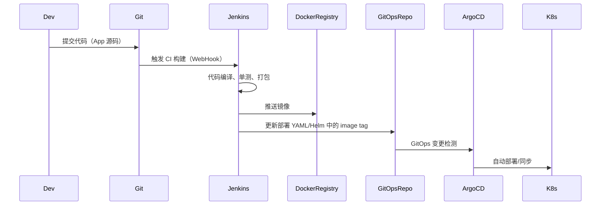

# Argo CD

ArgoCD（Argo Continuous Delivery）是一个声明式的、基于 GitOps 的 Kubernetes 持续交付工具，专为 Kubernetes 构建，用于自动化应用部署和生命周期管理。

## 时序图

```mermaid
sequenceDiagram
    participant Dev
    participant Git
    participant Jenkins
    participant DockerRegistry
    participant GitOpsRepo
    participant ArgoCD
    participant K8s

    Dev->>Git: 提交代码（App 源码）
    Git->>Jenkins: 触发 CI 构建（WebHook）
    Jenkins->>Jenkins: 代码编译、单测、打包
    Jenkins->>DockerRegistry: 推送镜像
    Jenkins->>GitOpsRepo: 更新部署 YAML/Helm 中的 image tag
    GitOpsRepo->>ArgoCD: GitOps 变更检测
    ArgoCD->>K8s: 自动部署/同步
```
