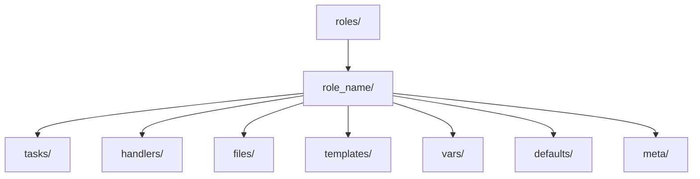

# 基础

## 安装

- Ubuntu

```shell
sudo apt update && sudo apt install ansible
```

## 清单（Inventory）

### host

```ini
[kube_master]
master ansible_host=172.29.101.173 ansible_user=root

[kube_node]
node1 ansible_host=172.29.101.174 ansible_user=root
node2 ansible_host=172.29.101.175 ansible_user=root
node3 ansible_host=172.29.101.176 ansible_user=root
```

测试主机连通性

```shell
ansible -m ping all
```

## 剧本（Playbook）

> 一个剧本由一个或多个按顺序排列的“剧目”组成。“剧本”和“剧目”这两个术语是体育类比。每个剧目执行剧本的总体目标的一部分，运行一个或多个任务。每个任务调用一个 Ansible 模块。


```yaml
- hosts: all
  become: yes
  roles:
    - common

- hosts: kube_master
  become: yes
  roles:
    - k8s-master

- hosts: kube_node
  become: yes
  roles:
    - k8s-node
```



## 角色（Role）

> 角色是 Ansible 的核心概念，它定义了任务和变量的集合。

角色由一个或多个文件组成，这些文件定义了角色的元数据、变量、任务、模板、文件、handlers 等。

```shell
│  inventory.ini
│  kubeadm-config.yaml
│  playbook.yml
│  
└─roles
    ├─common
    |  └─meta/main.yml
    │  └─tasks/main.yml
    |
    ├─k8s-master
    │  └─tasks/main.yml
    |
    └─k8s-node
        └─tasks/main.yml
```

### 角色元数据文件 `common/meta/main.yml`

> 描述这个角色信息和依赖关系

```yaml
dependencies:
  - role: common
  - role: k8s-master
```

### 角色器任务文件 `common/tasks/main.yml`

```yaml
- name: Disable Swap
  shell: |
    swapoff -a
    sed -i '/swap/d' /etc/fstab

- name: Enable IP forwarding
  sysctl:
    name: net.ipv4.ip_forward
    value: '1'
    state: present
    reload: yes

- name: Load kernel modules
  shell: |
    modprobe overlay
    modprobe br_netfilter

- name: Set sysctl for Kubernetes networking
  copy:
    dest: /etc/sysctl.d/k8s.conf
    content: |
      net.bridge.bridge-nf-call-iptables = 1
      net.ipv4.ip_forward = 1
      net.bridge.bridge-nf-call-ip6tables = 1
  notify: Reload sysctl

- name: Install containerd (or Docker)
  apt:
    name:
      - containerd
    state: present
    update_cache: yes
```

### 角色任务文件 `k8s-master/tasks/main.yml`

```yaml
- name: Copy kubeadm config
  copy:
    src: ../../kubeadm-config.yaml
    dest: /root/kubeadm-config.yaml

- name: Init Kubernetes Master
  shell: |
    kubeadm init --config /root/kubeadm-config.yaml --upload-certs
  args:
    creates: /etc/kubernetes/admin.conf
  register: kubeadm_init_result
  
- name: Set KUBECONFIG for root
  shell: |
    mkdir -p $HOME/.kube
    cp -i /etc/kubernetes/admin.conf $HOME/.kube/config
    chown $(id -u):$(id -g) $HOME/.kube/config

- name: Deploy Calico network plugin
  shell: |
    kubectl apply -f https://raw.githubusercontent.com/projectcalico/calico/v3.25.0/manifests/calico.yaml

- name: Deploy local-path-provisioner
  shell: |
    kubectl apply -f https://raw.githubusercontent.com/rancher/local-path-provisioner/master/deploy/local-path-storage.yaml

- name: Get join token
  shell: kubeadm token create --print-join-command
  register: join_command

- name: Set fact for join command
  set_fact:
    kube_join_command: "{{ join_command.stdout }}"
```

### 角色任务文件 `k8s-node/tasks/main.yml`

```yaml
- name: Join worker node to cluster
  shell: "{{ hostvars['master'].kube_join_command }} --root-dir /iflytek/kubelet"
  when: "'node' in inventory_hostname"
```

## 安装软件包

```yaml
- name: 安装软件包（CentOS/RedHat）
  hosts: servers
  become: true
  tasks:
    - name: 安装单个软件包
      yum:
        name: httpd
        state: present   # 可选: present/latest/absent

    - name: 安装多个软件包
      yum:
        name:
          - git
          - curl
          - vim
        state: latest

    - name: 移除软件包
      yum:
        name: nano
        state: absent
```

| 参数             | 作用                                      |
| -------------- | --------------------------------------- |
| `name`         | 软件包名，可以是单个或列表                           |
| `state`        | `present`（安装）、`latest`（更新）、`absent`（卸载） |
| `enablerepo`   | 指定启用的仓库                                 |
| `disablerepo`  | 禁用某些仓库                                  |
| `update_cache` | 类似 `yum makecache`，更新缓存                 |


## include/import

```yaml
- import_tasks: install.yml
- include_tasks: config.yml
- include_vars: vars/common.yml
```

### import_tasks

静态导入（Static）

解析时机：在 Playbook 解析阶段 就会读取并合并到任务列表。

优点：能参与条件判断（when）优化，比如 tags 过滤会在执行前生效。

缺点：不能根据运行时条件动态决定是否导入。

```yaml
- name: 静态导入安装任务
  import_tasks: install.yml
```

### include_tasks

动态导入（Dynamic）

解析时机：在 运行阶段 才会读取。

优点：可以在运行时根据条件选择是否导入（适合配合 when）。

缺点：tags 在执行前无法提前解析（需要执行到那一步才知道内容）。

```yaml
- name: 动态导入配置任务
  include_tasks: config.yml
  when: ansible_facts['os_family'] == 'Debian'

```

### include_vars

用来加载变量文件（YAML、JSON、INI）。

解析时机：运行阶段（动态加载）。

常用于按条件加载不同环境的变量。

```yaml
- name: 加载公共变量
  include_vars: vars/common.yml

- name: 按系统加载变量
  include_vars: "vars/{{ ansible_facts['os_family'] }}.yml"
```

## 变量（Vars）

用来定义在 Playbook、Role 或 Task 中使用的变量。

可以是静态值，也可以从外部文件（vars_files）加载。

优先级：vars > vars_files > defaults

```yaml
# vars/main.yml
app_name: my_app
app_port: 8080
db_host: 127.0.0.1
```

```yaml
- hosts: webservers
  vars:
    http_port: 80
    max_clients: 200
  vars_files:
     - vars/main.yml
```

## 模板（Template）

通过 Jinja2 渲染模板文件，将变量替换到文件中，然后部署到目标主机。

常用于配置文件生成（如 Nginx、Systemd service、MySQL 配置等）。

文件通常放在 templates/ 目录下。

```conf
# templates/nginx.conf.j2
server {
  listen {{ app_port }};
  server_name {{ app_name }};
  location / {
    proxy_pass http://{{ db_host }};
  }
}
```

```yaml
- name: 配置 Nginx
  template:
    # src: templates/nginx.conf.j2 引用根目录的
    src: nginx.conf.j2
    dest: /etc/nginx/nginx.conf
    owner: root
    group: root
    mode: 0644
```

## 处理器（Handlers）

用来在任务执行后触发一次的动作（通常是服务重启、通知）。

只有在 Task 通过 notify 调用时才会执行。

可以放在 Role 的 handlers/main.yml 中。

```yaml
# handlers/main.yml
- name: 重启 Nginx
  service:
  name: nginx
  state: restarted
```

```yaml
- name: 更新 Nginx 配置
  template:
  src: nginx.conf.j2
  dest: /etc/nginx/nginx.conf
  notify:
    # 调用 handlers
    - 重启 Nginx
```

## 委派（Delegate）

在 Ansible 中，有时我们需要将任务 委派（delegate）给其他主机 执行，而不是在当前 Playbook 主机上执行。

delegate_to: some_host 表示把任务在 some_host 上运行。

默认情况下，任务结果中的 facts 或 register 的变量 会被存到 当前 Playbook 的主机（inventory host），而不是 some_host。

delegate_facts: true 可以改变这个行为，让 facts 或 register 的变量存到 被委派的主机。

```yaml
- hosts: kube_master
  gather_facts: false
  tasks:
    - name: Get join token
      shell: kubeadm token create --print-join-command
      register: join_command
      # 只在一个 master 上执行
      run_once: true
      # 指定第一个 master 节点执行
      delegate_to: "{{ groups['kube_master'][0] }}"  
 
     - name: Set fact for all hosts
        set_fact:
        kube_join_command: "{{ join_command.stdout }}"
        run_once: true
        # 把变量存到 localhost
        delegate_to: localhost
        # 让这个 fact 对所有 host 可见
        delegate_facts: true
```

## 文件操作

### 文件与目录管理

| 功能  | 模快 | 说明 |
| --------------- | ------------------- | ---------------------------------------------------------------- |
| 创建/删除文件、目录、符号链接 | **[`ansible.builtin.file`](https://docs.ansible.com/ansible/latest/collections/ansible/builtin/file_module.html)**| `state: touch` 创建空文件，`state: directory` 创建文件夹，`state: absent` 删除 |
| 复制文件到远程| **[`ansible.builtin.copy`](https://docs.ansible.com/ansible/latest/collections/ansible/builtin/copy_module.html)**| 支持直接指定内容或本地文件路径|
| 下载文件到本地| **[`ansible.builtin.fetch`](https://docs.ansible.com/ansible/latest/collections/ansible/builtin/fetch_module.html)** | 从远程主机拉文件到控制机  |
| 同步目录（支持 rsync）  | **[`ansible.builtin.synchronize`](https://docs.ansible.com/ansible/latest/collections/ansible/builtin/synchronize_module.html)** | 类似 `rsync` |
| 从 URL 下载  | **[`ansible.builtin.get_url`](https://docs.ansible.com/ansible/latest/collections/ansible/builtin/get_url_module.html)**| 直接 HTTP/HTTPS 下载文件  |

```yaml
- name: 创建文件夹
  ansible.builtin.file:
    path: /tmp/mydir
    state: directory
    mode: '0755'

- name: 创建空文件
  ansible.builtin.file:
    path: /tmp/empty.txt
    state: touch

- name: 删除文件
  ansible.builtin.file:
    path: /tmp/oldfile.txt
    state: absent

- name: 从本地复制文件到远程
  ansible.builtin.copy:
    src: ./localfile.txt
    dest: /tmp/localfile.txt
    mode: '0644'

- name: 从远程下载文件到控制机
  ansible.builtin.fetch:
    src: /etc/hosts
    dest: ./hosts_backup/
    flat: yes

- name: 同步目录（rsync）
  ansible.builtin.synchronize:
    src: ./localdir/
    dest: /tmp/remotedir/
```

### 压缩与解压

| 功能| 模块| 说明  |
| ------------- | ---------------------- | ------------------------------------ |
| 解压 zip/tar 文件 | **[`ansible.builtin.unarchive`](https://docs.ansible.com/ansible/latest/collections/ansible/builtin/unarchive_module.html)** | 支持本地和远程解压，`remote_src: yes` 代表文件已在远程 |
| 压缩/打包目录 | **[`community.general.archive`](https://docs.ansible.com/ansible/latest/collections/community/general/archive_module.html)** | 类似 `tar` 打包功能|

```yaml
- name: 解压 tar.gz 文件（已在远程）
  ansible.builtin.unarchive:
    src: /tmp/archive.tar.gz
    dest: /opt
    remote_src: yes

- name: 解压 zip 文件（控制机上传）
  ansible.builtin.unarchive:
    src: ./file.zip
    dest: /opt
    remote_src: no
```

### 文本与配置文件处理

| 功能  | 模块 | 说明  |
| --------- | ------------------------------ | ------------------ |
| 通过模板生成文件  | **[`ansible.builtin.template`](https://docs.ansible.com/ansible/latest/collections/ansible/builtin/template_module.html)** | 使用 Jinja2 模板渲染  |
| 修改文本行  | **[`ansible.builtin.lineinfile`](https://docs.ansible.com/ansible/latest/collections/ansible/builtin/lineinfile_module.html)**| 确保某行存在/替换匹配行 |
| 修改多行（正则）  | **[`ansible.builtin.blockinfile`](https://docs.ansible.com/ansible/latest/collections/ansible/builtin/blockinfile_module.html)** | 批量插入/替换文本块|
| 查找并替换  | **[`ansible.builtin.replace`](https://docs.ansible.com/ansible/latest/collections/ansible/builtin/replace_module.html)**| 支持正则替换 |
| 设置变量为文件内容 | **[`ansible.builtin.slurp`](https://docs.ansible.com/ansible/latest/collections/ansible/builtin/slurp_module.html)** | 读取文件（base64 编码）到变量 |

```yaml
- name: 通过模板生成配置文件
  ansible.builtin.template:
    src: nginx.conf.j2
    dest: /etc/nginx/nginx.conf
    mode: '0644'

- name: 确保某行存在（或替换匹配行）
  ansible.builtin.lineinfile:
    path: /etc/myapp/config.ini
    regexp: '^listen_port='
    line: 'listen_port=8080'

- name: 插入一个文本块
  ansible.builtin.blockinfile:
    path: /etc/myapp/config.ini
    block: |
      [extra]
      key=value

- name: 查找并替换（支持正则）
  ansible.builtin.replace:
    path: /etc/myapp/config.ini
    regexp: '^debug=.*'
    replace: 'debug=false'

- name: 读取文件内容到变量
  ansible.builtin.slurp:
    src: /etc/hostname
  register: file_content

- name: 显示文件内容（解码）
  ansible.builtin.debug:
    msg: "{{ file_content.content | b64decode }}"
```

### 权限与属性

| 功能  | 模块 | 说明  |
| --------- | ----------------------------- | --------------------------- |
| 修改权限、属主属组 | **`file`** | `mode`, `owner`, `group` 参数 |
| 设置 ACL 权限 | **[`ansible.posix.acl`](https://docs.ansible.com/ansible/latest/collections/ansible/posix/acl_module.html)** | POSIX ACL |

```yaml
- name: 修改权限和属主
  ansible.builtin.file:
    path: /tmp/localfile.txt
    owner: root
    group: root
    mode: '0644'
```

## 条件与循环

### 条件（when）

```yaml
- name: 仅在 Ubuntu 上执行
  apt:
    name: git
    state: present
  when: ansible_facts['os_family'] == 'Debian'
```

### 循环（loop）

```yaml
- name: 批量创建用户
  user:
    name: "{{ item }}"
    state: present
  loop:
    - user1
    - user2
```

## Ansible Vault（加密敏感信息）

```shell
# 创建加密文件（新建时直接加密）
ansible-vault create secrets.yml

# 编辑加密文件（会临时解密，保存后重新加密）
ansible-vault edit secrets.yml

# 查看加密文件内容（只读，不会解密到磁盘）
ansible-vault view secrets.yml

# 加密已有明文文件
ansible-vault encrypt secrets.yml

# 解密文件（转成明文，注意安全）
ansible-vault decrypt secrets.yml

# 修改加密文件的密码
ansible-vault rekey secrets.yml

# 运行 Playbook 时手动输入 Vault 密码
ansible-playbook playbook.yml --ask-vault-pass

# 运行 Playbook 时从文件读取 Vault 密码（文件权限建议 600）
ansible-playbook playbook.yml --vault-password-file ~/.vault_pass.txt
```

### 使用

```yaml
# secrets.yml (已加密)
db_user: root
db_pass: s3cr3t
```

```yaml
- hosts: all
  vars_files:
    - secrets.yml
  tasks:
    - name: 显示数据库密码
      debug:
        msg: "{{ db_pass }}"
```

## 调试过程

- 指定某个 `host` 执行

```shell
ansible-playbook -i inventory.ini playbook.yml --limit node2 -vv
```

- 指定某个 `role` 执行

`playbook.yml` 需要声明 `tags`

```yaml
- hosts: all
  roles:
    - { role: kube_prepare, tags: ["kube_prepare"] }
```

```shell
ansible-playbook -i inventory.ini playbook.yml --tags kube_prepare,kube_master -vv
```

### 调试等级

| 选项 | 等级说明 | 输出内容 | 适用场景 |
| ----------- | ------------------------ | -------------------------------------------------- | ------------------- |
| **`-v`**    | Verbose（基本详细） | 显示任务的额外信息，如 `changed` 的详细原因、`skipped` 的任务名等 | 日常调试，想看多一点 |
| **`-vv`**   | More Verbose（中等详细） | 在 `-v` 基础上，显示模块的参数（调用时传了什么）、部分模块返回值 | 检查任务传参是否正确 |
| **`-vvv`**  | Very Verbose（高度详细） | 在 `-vv` 基础上，显示和远程主机的执行命令、返回的完整 JSON 数据（未裁剪） | 深度调试任务行为 |
| **`-vvvv`** | Connection Debug（连接调试模式） | 在 `-vvv` 基础上，**增加 SSH 连接的详细日志**，包括 SSH 参数、密钥、握手过程等 | 排查连接问题（SSH、WinRM 等） |

## 命令

```shell
ansible --version         # 查看版本
ansible all -m setup      # 收集所有主机的 facts
ansible-doc -l            # 列出所有模块
ansible-doc copy          # 查看 copy 模块文档
ansible-playbook --check  # 仅检查，不执行变更
ansible-playbook --diff   # 显示变更内容
```

## Ansible Galaxy

```shell
ansible-galaxy install geerlingguy.nginx
ansible-galaxy init myrole
```
