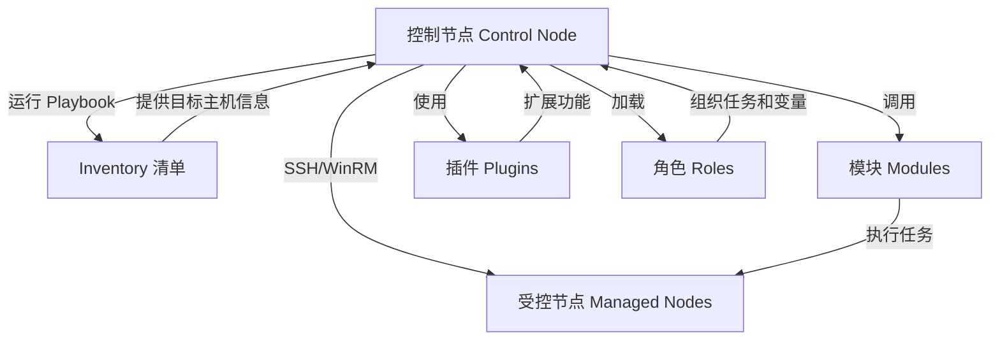

# Ansible

**Ansible 是一个开源的自动化运维工具**，由 Red Hat 主导维护，主要用于：

* **自动配置管理**（如安装软件、修改配置）
* **应用程序部署**（如部署 Java/Python/Go 应用）
* **IT 基础设施编排**（如搭建 K8s、Hadoop、OpenStack、Ceph）
* **自动执行任务**（如重启服务、更新系统、批量执行命令）



## 🔧 一句话理解

> **Ansible 是一种“声明式”的自动化工具，告诉服务器“最终应该是什么状态”，它自动帮你完成变更。**

## ✅ 特点概览

| 特性                | 描述                           |
| ----------------- | ---------------------------- |
| 🧩 无代理（Agentless） | 只需要 SSH（或 WinRM），不需在目标机安装客户端 |
| 📦 模块化            | 使用内置模块完成任务，如安装软件、管理用户        |
| 🧙 简洁             | 使用 YAML 写 playbook，语法人类可读    |
| 🚀 可扩展            | 支持自定义模块、角色（role）、插件等         |
| 🔐 安全             | 支持 Vault 加密变量，适用于生产          |

## 📘 架构图（简化）

[ 控制机（Ansible） ]
        |
   SSH / WinRM
        |
[ 目标主机 1 ] [ 目标主机 2 ] ...

Ansible 控制节点通过 SSH 登录远程主机，执行任务。

## 📋 常见术语解释

| 概念            | 说明                         |
| ------------- | -------------------------- |
| **Inventory** | 主机清单（IP/域名分组）              |
| **Playbook**  | 自动化剧本，使用 YAML 描述多个任务       |
| **Task**      | 单个任务，如“安装 Nginx”           |
| **Module**    | 功能模块，如 `yum`、`copy`、`user` |
| **Role**      | 可重用的自动化角色集合（变量 + 任务 + 模板）  |
| **Facts**     | 收集的目标主机信息（如 IP、系统版本）       |
| **Handlers**  | 触发式任务（如配置变更后 reload nginx） |

## 🧪 示例：安装并启动 nginx

```yaml
- name: 安装并启动 nginx
  hosts: web
  become: true
  tasks:
    - name: 安装 nginx
      ansible.builtin.yum:
        name: nginx
        state: present

    - name: 启动 nginx
      ansible.builtin.service:
        name: nginx
        state: started
        enabled: true
```

## 🔧 Ansible 能做什么？

| 领域    | 示例                          |
| ----- | --------------------------- |
| 系统初始化 | 关闭 SELinux、防火墙、设置主机名        |
| 应用部署  | 批量部署 Node.js、Java、Python 应用 |
| 运维管理  | 批量执行命令、管理服务状态               |
| 云资源管理 | 管理 AWS/GCP/阿里云的主机、网络        |
| 虚拟化管理 | 管理 KVM、libvirt、VMware       |
| 容器管理  | 安装 Docker、部署 Kubernetes     |
| 安全合规  | 修改密码策略、检查弱口令                |

## 🔄 与其他工具对比

| 工具                      | 主要用途     | 与 Ansible 区别      |
| ----------------------- | -------- | ----------------- |
| **SaltStack**           | 自动化运维    | 更复杂、依赖 agent      |
| **Terraform**           | 基础设施编排   | 侧重“云资源创建”，不做配置管理  |
| **Chef / Puppet**       | 配置管理     | 都需要 agent，学习曲线更陡峭 |
| **Jenkins / GitLab CI** | CI/CD 工具 | 可调用 Ansible 做部署   |

---

## ✅ 总结

> **Ansible 是一种简单、强大、无 agent 的自动化工具，广泛用于 IT 运维、部署和基础设施编排。**
