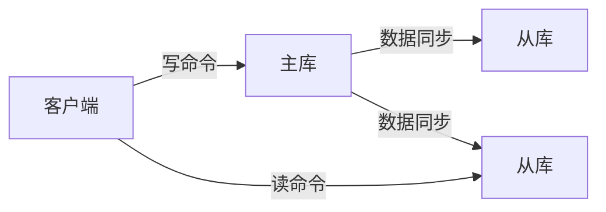
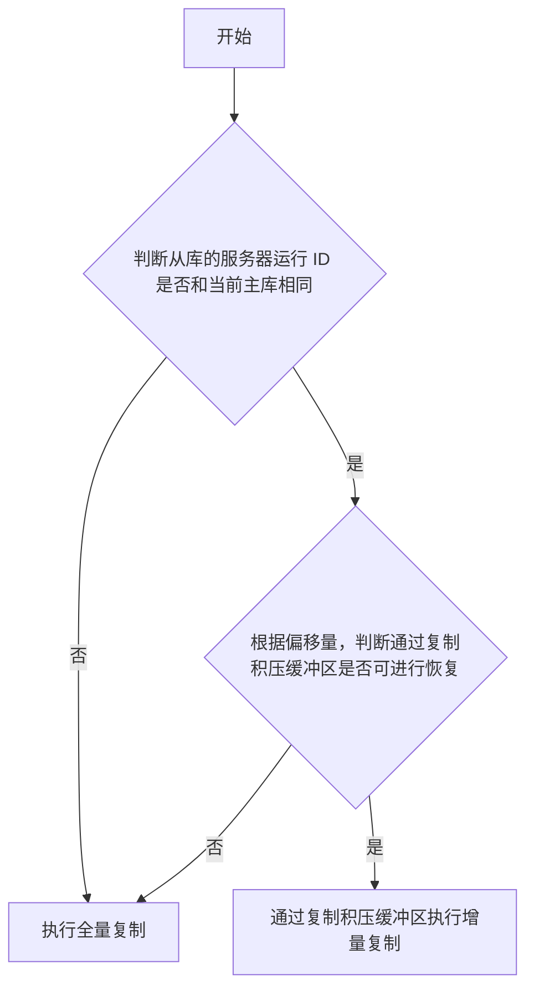
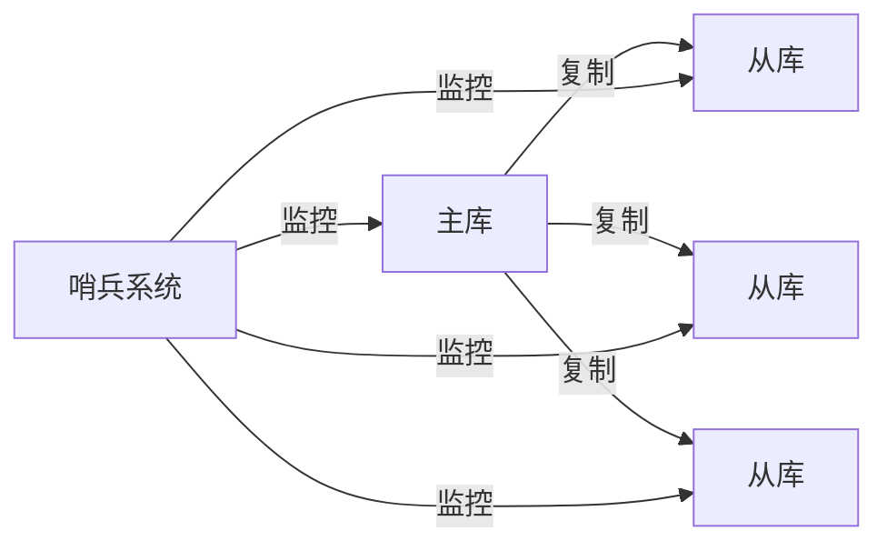
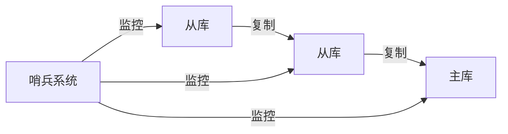
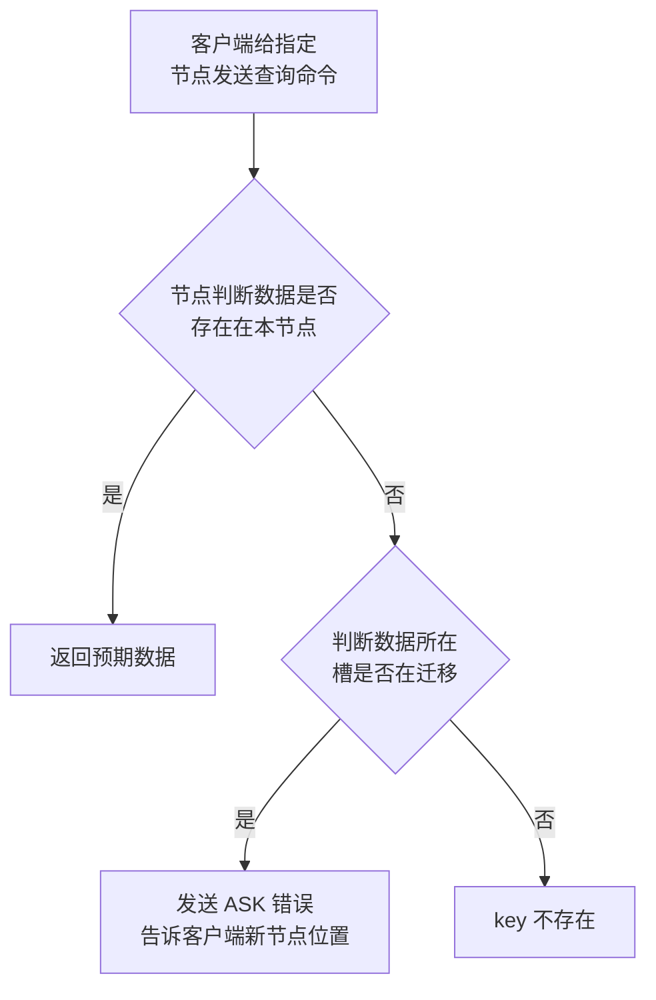

# 集群

## 复制

> + 写命令落到主库，主库完成以后，在同步给从库，会有一定的时延性
> + 读命令落到从库，读到的数据可能会有时延性
>

1. 同步流程
    1. 当主库从库上线后，他们不急着直接进行复制过程，首先需要进行握手，进行信息验证。端口ip
    2. 当握手完成后，从库需要向主库发送 PSYN 命令，即同步命令，开启数据同步过程，**并发送主库 ID（防止主库被人为切换）**，**复制的进度偏移量 offset（断线续传）**
    3. 主库会根据从库发送的信息，进行逻辑判断，并告诉从库，是进行**全量复制/断线后重复制**
    4. 同步完成以后，命令传播阶段：主库状态被修改了（如增加了新数据，修改了原始数据）为了使得从库和主库数据状态一致，主库将会把数据变更命令发给从库，从库收到后执行命令
2. 全量复制
    1. 主库执行BGSAVE，生成对应的RDB文件，同时开辟缓冲区，记录在RDB文件实行过程中，收到的新数据命令
    2. RDB文件产生后，主库发给从库，从库通过RDB恢复数据
3. 断线后重复制
    1. 断线后重复制：从库与主库断线重连后复制，此过程依赖服务器运行ID，复制偏移量，复制积压缓冲区
    2. 服务器运行ld：唯一确定主库身份
    3. 复制偏移量：代表主节点传输了的字节数
    4. 复制积压缓冲区：复制积压缓冲区是一个先进先出队列，**存储了最近主节点的数据修改命令**

## 哨兵

> + 即新建哨兵组，对主库从库统一进行监控，如果主库坏了，哨兵组进行投票，从从库中重新选出主库
> + 本质上，从代码层面上讲，哨兵是一个不提供数据服务的redis服务器
>

1. 每个机器都会向哨兵一定时间（ 10秒)发送信息（也称为心跳）哨兵系统如果一定时间收不到这个信息，就默认这个机器断联了。
2. 当某个哨兵发现主库连接不上，会将其标注为主观下线，并通知其他哨兵连接一下主库试试。超过半数哨兵确认连接不上后，就会标记该主库为客观下线，并执行故障转移（从从库中挑个当主库）
3. 在故障转移过程中，会通过选举协议，从所有哨兵中**选择一个节点（选择一个数据最为接近主库的节点）**，作为老大，主持负责新主库的选举工作选取完成后，哨兵会对这个从库发送slaveof no one，此时该从库就变成主库了。同时向其他slave发送新主库的IP端口号

4. 如果此时主库重新上线，它就会被哨兵系统降级为从库，从属于新的主库

## 集群模式

> Cluster
>
> + Redis提供的分布式数据库解决方案
> + 自动将你的数据切分给多个节点存储
> + 即使这些节点中一部分宕机，也可以继续执行数据操作
>

1. 分区策略：
    1. 采用虚拟槽，所有键通过CRC16校验函数，对16384取模，决定数据分配到哪个槽位。
    2. 每个redis的cluster节点负责一部分槽数据的存储
    3. 并且该节点可以结合之前讲到的主从复制模式，将分配给它的数据进行复制
2. 查询策略：
    1. 每个节点都会存储整个集群节点信息，这些信息也被称为**元信息**（每一个节点都有元数据信息）
        1. 各节点存储的槽数据
        2. 各节点的 master 和 slave 状态
        3. 各节点是否存活
    2. 元数据信息的传播：**gossip** 协议，每个节点都把自己的数据信息通过这个协议散步出去
        1. **gossip **协议是周期性的，每隔一定时间，执行一次。
        2. 所有被感染节点选择k个邻接节点散步信息
3. 扩容
    1. 由于集群数据可能出现服务器扩容（数据太多了加节点）
    2. 扩容时候的查询逻辑，会去查询所在槽是否在发送迁移，如果在迁移则报告错误，返回新节点信息

4. 缩容
    1. 服务器缩容（数据太少减少节点避免浪费）在该过程中，数据会发生迁移
