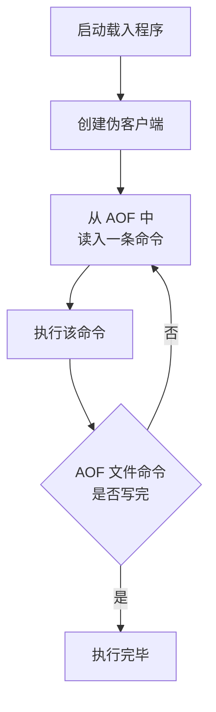
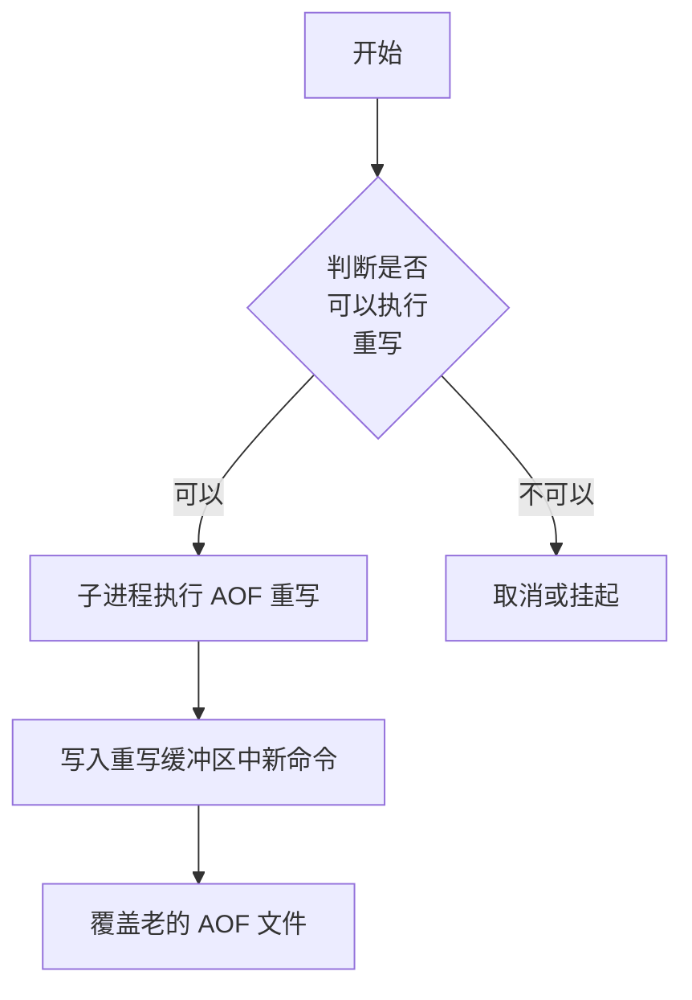

# 持久化

## RDB

> Redis data base
>

1. 机制
    1. 隔一段时间去写到磁盘
    2. 把目前redis内存中数据，生成一个快照(RDB文件)，保存在硬盘中如果发生事故，redis可以通过RDB文件，进行文件读取，并将数据重新载入内存中全量备份
    3. 属于全量备份
2. 数据结构

3. 触发条件
    1. 自动触发
        1. save:执行该指令后，主线程执行rdbSave函数，服务器进程阻塞，即不能处理任何其他请求
        2. bgsave(background save):本质上这个命令和save差不多，区别在于这个命令会fork了一个子进程，去执行rdbSave函数,因此主线程还是可以执行新请求的。
    2. 手动触发
        1. 配置文件中写入save m n，代表当m秒内发生n次变化时，会自动执行bgsave

## AOF

> append only file
>

1. 机制
    1. 修改命令的操作都写到日志
    2. 如果发生事故，redis可以通过AOF文件，将文件中的数据修改命令全部执行一遍，以此恢复数据
2. 重写与恢复
    1. 文件重写策略，根据当前数据库的状态，创建一个新的AOF文件，以替代原有的冗余AOF文件
    2. 新的AOF文件可一点都不会参考老版AOF文件，而是由当前Redis数据状态生成的

- Redis 恢复策略

- Redis 重写流程

1. 触发条件
    1. 手动触发：bgwiteraof
    2. 自动触发：配置文件中设置 appendonly yes 开启，默认策略是 Everysec
        1. **Always**：即同步写回，在每个写命令执行完成后，直接将命令落入磁盘文件（数据基本保证可靠性，但是影响Redis的性能）
        2. **Everysec**：即每秒写回，对于每个命令执行完成后，该命令被写入文件的内存缓存区，每过1秒，redis会把该缓存区命令写到磁盘的AOF文件中（出了问题最多丢失一秒内数据，性能影响较小)
        3. **No**：这个No不是不执行AOF，而是将操作命令全部只写到Redis缓存区，至于在何时将缓存数据落盘，交给**操作系统决定**（出了问题，数据丢失情况不可控，性能影响最小)
