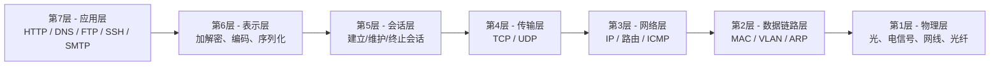
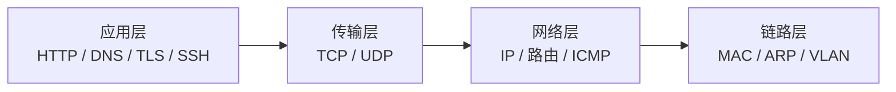
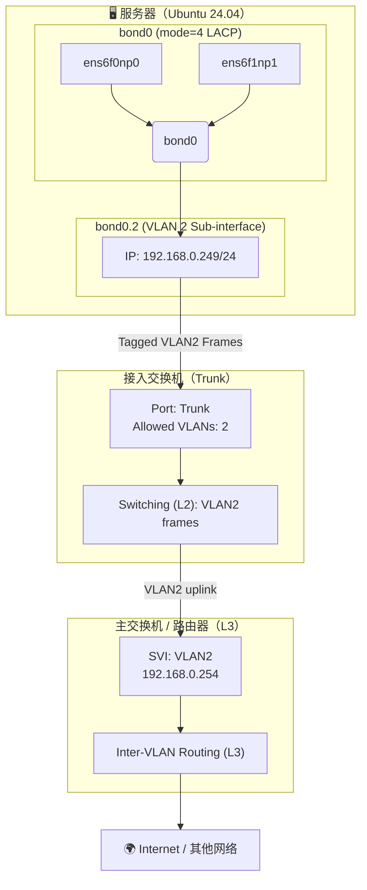

# OSI

## 核心理解

OSI 7 层是 **理论模型**，严格分层；TCP/IP 4 层是 **实用模型**，实际互联网都用 4 层。

## OSI 七层模型



## 七层模型

| 层级 | 名称       | 代表协议                  | 核心作用               | 工程师视角关键点                    |
| ---- | ---------- | ------------------------- | ---------------------- | ----------------------------------- |
| 7    | 应用层     | HTTP、DNS、SSH、FTP、SMTP | 最终给用户和程序用     | 请求失败排查通常从这里往下看        |
| 6    | 表示层     | TLS/SSL、编码、压缩       | 加密、解密、序列化     | HTTPS = HTTP(7) + TLS(6)            |
| 5    | 会话层     | RPC、NetBIOS              | 维持会话状态           | 实际中常与应用层混合在一起          |
| 4    | 传输层     | TCP、UDP                  | 端口、连接、分片重传   | NAT、端口映射都在这一层             |
| 3    | 网络层     | IP、ICMP、路由            | IP 地址、路由选择      | ping / traceroute 属于本层          |
| 2    | 数据链路层 | Ethernet、VLAN、ARP       | MAC、交换机、VLAN 隔离 | VLAN tag、trunk、bonding 都在这一层 |
| 1    | 物理层     | 光、电信号、网线          | 电信号/光信号          | 换网线、换模块就是干这一层          |

## TCP/IP 四层模型



## 四层模型笔记表

| TCP/IP 层级 | 对应 OSI  | 代表协议       | 工程用途                     |
| ----------- | --------- | -------------- | ---------------------------- |
| 应用层      | 7 / 6 / 5 | HTTP、DNS、TLS | K8s Ingress、Web 服务        |
| 传输层      | 4         | TCP、UDP       | NodePort、端口映射、负载均衡 |
| 网络层      | 3         | IP、ICMP、路由 | K8s Pod/CNI IP、路由表       |
| 链路层      | 2 / 1     | MAC、VLAN      | VLAN、Bonding、Trunk         |

## 具体应用

### 1. **K8s/Docker 网络主要发生在：**

* **第 2 层**：VLAN、Linux bridge、Macvlan、Bonding
* **第 3 层**：Pod IP、Service ClusterIP、路由
* **第 4 层**：NodePort、负载均衡

### 2. **VLAN 属于第 2 层**

* 通过 **往以太网帧插入 4 字节 tag** 实现隔离
* VLAN ID＝你自己定义，只要交换机一致即可（范围 1-4094）
* Trunk 模式 = 可以通过多个 VLAN（带 tag）
* Access 模式 = 只能进入一个 VLAN（不带 tag）

### 3. **"mode" 大多指 Bonding 模式（链路聚合）**

Bonding 属于 **二层链路层**（跟 VLAN 同一层）

常用 mode：

| mode | 名称          | 特点                               |
| ---- | ------------- | ---------------------------------- |
| 0    | balance-rr    | 轮询负载、简单、常见               |
| 1    | active-backup | 主备（最常用）                     |
| 4    | 802.3ad(LACP) | 需要交换机支持、带宽聚合           |
| 6    | balance-alb   | 自适应负载，最灵活，不需交换机配置 |

## 链路层

### VLAN

**VLAN = Virtual LAN（虚拟局域网）**
属于 **二层（数据链路层）技术**。

#### 核心功能

**通过在以太网帧里插入 4 字节 tag，把一个交换机逻辑上切成多个隔离的“小交换机”。**

#### VLAN 的价值

* 把不同业务隔离（安全）
* 不同部门隔离（办公、服务器分开）
* 同一 VLAN 内二层广播互通
* 可以减少广播域

#### VLAN 的类型

| 类型                  | 特点                   |
| ------------------- | -------------------- |
| VLAN Access         | 不带 tag，终端设备（服务器/PC）用 |
| VLAN Tagged / Trunk | 带 tag，可承载多个 VLAN IDs |

#### VLAN ID

* 范围：1~4094
* 你可以随便定义，只要交换机两端一致
* VLAN2 的数字“2”就是一个 **隔离 ID**，没有特别含义

### Trunk

**Trunk = 可以同时传多个 VLAN 的链路模式**
同样属于 **数据链路层（L2）技术**。

#### 为什么需要 Trunk？

Trunk 就是：
**一根网线，把多个 VLAN 的 tag 封进去，一起走。**

#### Trunk 的特点

* 带 VLAN tag（802.1Q 标准）
* 可以承载多个 VLAN（tagged VLAN）
* 交换机 ⇆ 交换机、交换机 ⇆ 服务器常见

#### 示例：

如果你服务器用 VLAN2，
交换机接口需要：

```
switchport mode trunk
switchport trunk allowed vlan 2
```

服务器网卡配置 VLAN 子接口：

```
eth0.2  => VLAN 2
```

### Bonding

**Bonding = 把多根物理网卡捆绑成一根逻辑网卡（bond0）。**

这是 **二层（L2）或三层（L3）都可以用** 的技术。

### Bonding 的作用

* 提升带宽（多根网卡并行为一根）
* 做高可用（主备模式）
* 做负载均衡

#### 常用 Bonding 模式（最常见的 4 种）

| 模式     | 名称             | 要不要交换机配合 | 特点                |
| ------ | -------------- | -------- | ----------------- |
| mode=1 | active-backup  | ❌ 不要     | 主备高可用             |
| mode=0 | balance-rr     | ❌ 不要     | 轮询负载              |
| mode=4 | 802.3ad / LACP | ✅ 必须     | 真正带宽聚合（交换机+服务器协商） |
| mode=6 | balance-alb    | ❌ 不需要    | 最智能、无交换机依赖        |

#### 例子：

如果你想把 eth0 和 eth1 合成 bond0：

* mode=1：高可用（推荐）
* mode=4：需要交换机配置 LACP
* mode=6：平衡负载，不需要交换机支持

### 三者的关系

| 技术      | 工作层级  | 作用           | 与服务器关系                      |
| ------- | ----- | ------------ | --------------------------- |
| VLAN    | L2    | 二层隔离         | 服务器可以加 VLAN 子接口（eth0.2）     |
| Trunk   | L2    | 一根线承载多个 VLAN | 服务器网卡必须支持 VLAN tagging      |
| Bonding | L2/L3 | 多网卡合成一张      | bond0 上还可以继续加 VLAN（bond0.2） |

### 组合用法（你实际环境可能就是这样）

#### 服务端常见架构：

```
物理网卡 eth0 + eth1 → bond0 → VLAN 子接口 bond0.2 → K8s 节点 IP
```

也就是：

* bond0 做链路聚合
* bond0.2 是 VLAN2 的子接口
* 最终 IP 配在 bond0.2 上

#### 交换机侧：

```
端口 = Trunk
允许 VLAN 2
LACP（如果你服务器是 mode=4）
```


