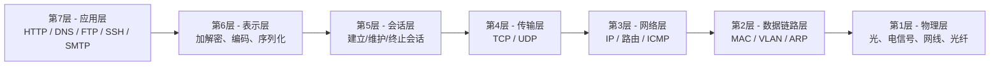
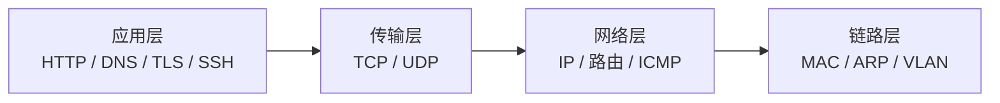

# OSI

## 核心理解

OSI 7 层是 **理论模型**，严格分层；TCP/IP 4 层是 **实用模型**，实际互联网都用 4 层。

# OSI 七层模型

# 七层模型

| 层级 | 名称       | 代表协议                  | 核心作用               | 工程师视角关键点                    |
| ---- | ---------- | ------------------------- | ---------------------- | ----------------------------------- |
| 7    | 应用层     | HTTP、DNS、SSH、FTP、SMTP | 最终给用户和程序用     | 请求失败排查通常从这里往下看        |
| 6    | 表示层     | TLS/SSL、编码、压缩       | 加密、解密、序列化     | HTTPS = HTTP(7) + TLS(6)            |
| 5    | 会话层     | RPC、NetBIOS              | 维持会话状态           | 实际中常与应用层混合在一起          |
| 4    | 传输层     | TCP、UDP                  | 端口、连接、分片重传   | NAT、端口映射都在这一层             |
| 3    | 网络层     | IP、ICMP、路由            | IP 地址、路由选择      | ping / traceroute 属于本层          |
| 2    | 数据链路层 | Ethernet、VLAN、ARP       | MAC、交换机、VLAN 隔离 | VLAN tag、trunk、bonding 都在这一层 |
| 1    | 物理层     | 光、电信号、网线          | 电信号/光信号          | 换网线、换模块就是干这一层          |

# TCP/IP 四层模型

# 四层模型笔记表

| TCP/IP 层级 | 对应 OSI  | 代表协议       | 工程用途                     |
| ----------- | --------- | -------------- | ---------------------------- |
| 应用层      | 7 / 6 / 5 | HTTP、DNS、TLS | K8s Ingress、Web 服务        |
| 传输层      | 4         | TCP、UDP       | NodePort、端口映射、负载均衡 |
| 网络层      | 3         | IP、ICMP、路由 | K8s Pod/CNI IP、路由表       |
| 链路层      | 2 / 1     | MAC、VLAN      | VLAN、Bonding、Trunk         |

## 具体应用

### 1. **K8s/Docker 网络主要发生在：**

* **第 2 层**：VLAN、Linux bridge、Macvlan、Bonding
* **第 3 层**：Pod IP、Service ClusterIP、路由
* **第 4 层**：NodePort、负载均衡

### 2. **VLAN 属于第 2 层**

* 通过 **往以太网帧插入 4 字节 tag** 实现隔离
* VLAN ID＝你自己定义，只要交换机一致即可（范围 1-4094）
* Trunk 模式 = 可以通过多个 VLAN（带 tag）
* Access 模式 = 只能进入一个 VLAN（不带 tag）

### 3. **"mode" 大多指 Bonding 模式（链路聚合）**

netplan Bonding 属于 **二层链路层**（跟 VLAN 同一层）

常用 mode：

| mode | 名称          | 特点                               |
| ---- | ------------- | ---------------------------------- |
| 0    | balance-rr    | 轮询负载、简单、常见               |
| 1    | active-backup | 主备（最常用）                     |
| 4    | 802.3ad(LACP) | 需要交换机支持、带宽聚合           |
| 6    | balance-alb   | 自适应负载，最灵活，不需交换机配置 |
