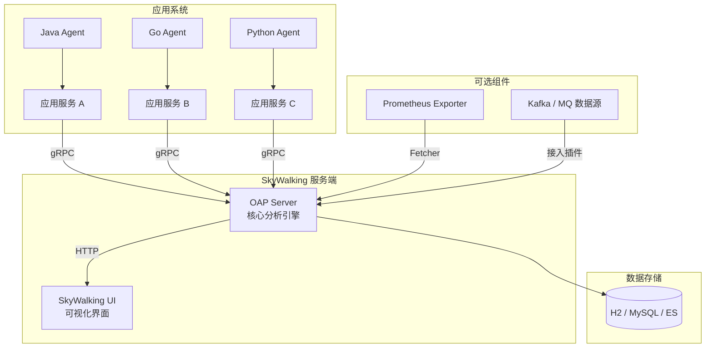

# 基础

> Apache SkyWalking 是一款开源的 APM（Application Performance Monitoring）+ 可观测性分析平台，专注于：
> 分布式链路追踪
>
> - 性能指标监控
> - 服务拓扑可视化
> - 服务/实例/端点级别的告警与分析
>
> 适用于 微服务、容器化、Service Mesh 和云原生架构。

## 核心功能

| 功能模块       | 说明                                 |
| ---------- | ---------------------------------- |
| 分布式链路追踪 | 自动记录跨服务的调用链（Trace）                 |
| 性能指标分析  | 记录响应时间、QPS、吞吐量、错误率等                |
| 服务拓扑图   | 展示服务之间的调用依赖关系                      |
| 告警系统    | 指标触发条件可配置报警                        |
| 日志（增强）  | 可选接入日志（与 Trace 相关联）                |
| 多协议支持   | 支持 HTTP/gRPC/MQ/Kafka/Service Mesh |
| 多语言探针   | Java、Node.js、Go、Python 等           |

## 关键概念

| 概念                | 说明                                       |
| ----------------- | ---------------------------------------- |
| **服务（Service）**   | 一个逻辑系统，比如 `user-service`、`order-service` |
| **实例（Instance）**  | 某个服务的部署副本，比如一台 Pod、一个 JVM 实例             |
| **端点（Endpoint）**  | 一个可观测的接口，比如 `/api/user/info`             |
| **Trace（链路）**     | 一次调用路径，如 A ➝ B ➝ C                       |
| **Span（跨度）**      | 一段具体操作，比如一次 DB 查询、一次 HTTP 请求             |
| **Segment**       | 某个实例中产生的一组 Span                          |
| **Metrics（指标）**   | 统计数据，如响应时间、TPS、错误率                       |
| **Topology（拓扑图）** | 服务之间的调用图关系                               |
| **Agent（探针）**     | 用于收集链路和指标的客户端工具（如 Java agent）            |
| **OAP（后端核心）**     | SkyWalking 的核心服务，接收 agent 数据，做分析         |
| **UI（前端页面）**      | Web 控制台，展示服务图谱、链路详情、指标面板等                |

## 常见端口

| 组件                 | 端口                 | 说明                          |
| ------------------ | ------------------ | --------------------------- |
| OAP                | `11800`            | gRPC，Agent 与 OAP 通讯         |
| OAP                | `12800`            | HTTP，UI 与 OAP 通讯、Metrics 拉取 |
| UI                 | `8080`（映射为如 18081） | Web 控制台页面                   |
| Prometheus Fetcher | 无默认端口（通过 OAP 拉取）   | 用于接入 Prometheus 数据源         |

## 架构


### Agent

* **作用**：探针，嵌入到应用进程（Java、Go、Python 等），拦截方法调用、采集 Trace、指标、日志。
* **位置**：运行在业务服务内（JVM、Go runtime、Python interpreter 等）。
* **关键功能**：

  * 采集调用链数据（Trace Segment）
  * 统计接口耗时、错误率、吞吐量
  * 插桩支持多种框架（Spring、Dubbo、HTTP Client、JDBC、Redis 等）
  * 将数据通过 **gRPC** 或 HTTP 发送到 OAP Server
* **举例**：
  在 Java 应用中加 `-javaagent:/path/skywalking-agent.jar -Dskywalking.agent.service_name=my-service`


### OAP（Observability Analysis Platform）

* **作用**：SkyWalking 的核心分析引擎，接收 Agent 上报的数据并进行处理。
* **位置**：独立运行的服务，可部署在 Docker、K8s、VM。
* **关键功能**：

  * 接收 Trace、Metrics、Logs 数据
  * 分析并拼接调用链（Trace Merging）
  * 生成拓扑图（Service / Endpoint / Instance 关系）
  * 存储到后端数据库（H2、ES、MySQL 等）
  * 提供 GraphQL API 给 UI 使用
* **举例**：
  接收 Java Agent 采集的 “服务 A 调用服务 B” 数据，合并为一个完整链路。
### Storage

* **作用**：存储 OAP 处理后的监控数据（Trace、指标、日志等）。
* **常见类型**：

  * **H2**（嵌入式，单机调试用）
  * **MySQL / PostgreSQL**（结构化存储，适合小规模生产）
  * **Elasticsearch**（分布式检索，适合大规模生产）
* **关键功能**：

  * 保存历史调用链，支持 UI 查询
  * 支持按时间、服务、端点等多维度分析
* **举例**：
  Elasticsearch 保存最近 7 天的调用链数据，方便查询“接口延迟趋势”。

### UI

* **作用**：SkyWalking 的可视化界面（Web），通过 GraphQL 向 OAP 查询数据并展示。
* **位置**：独立前端服务（默认端口 8080，可通过 Docker 运行）。
* **关键功能**：

  * 展示服务拓扑图（调用关系）
  * 展示 Trace 明细（每一步耗时）
  * 展示 Metrics 图表（QPS、RT、错误率等）
  * 展示日志（需接入日志插件）
* **举例**：
  在浏览器访问 `http://<skywalking-ui-host>:8080` 查看集群调用链路。



## 设计目标

### 保持可观测性

* **解释**：核心目标是让用户能清晰了解系统的运行状况，特别是分布式系统中的调用链路、性能瓶颈和异常点。
* **具体体现**：

  * Trace（调用链）展示每一次请求的路径
  * Metrics（指标）展示服务健康趋势
  * Logs（日志）结合 Trace 定位问题
* **意义**：快速发现并定位问题，降低 MTTR（平均修复时间）。

### 拓扑结构

* **解释**：自动分析服务间调用关系并生成拓扑图。
* **具体体现**：

  * 节点代表服务、实例或端点
  * 边代表调用方向及次数/耗时
  * 自动更新（无需人工维护）
* **意义**：让复杂系统的依赖关系可视化，方便架构优化和瓶颈分析。

### 轻量级

* **解释**：部署和运行成本低，尽可能减少对业务性能的影响。
* **具体体现**：

  * Agent 运行在业务进程中，占用资源低（一般 CPU < 5%，内存 < 50MB）
  * OAP 支持按需部署、可横向扩展
* **意义**：在生产环境中不会成为新的性能瓶颈。

### 可插拔

* **解释**：功能模块可灵活选择、扩展和替换。
* **具体体现**：

  * 插件机制：支持多种框架探针（HTTP、RPC、DB、MQ 等）
  * 存储层可替换（H2、MySQL、ES、PostgreSQL 等）
  * 数据接入协议可扩展（gRPC、HTTP、Prometheus Fetcher 等）
* **意义**：用户可以按需裁剪功能，减少不必要的开销。

### 可移植

* **解释**：支持多种运行环境和语言，不依赖特定平台。
* **具体体现**：

  * 支持 Java、Go、Node.js、Python、PHP 等多语言 Agent
  * 支持容器化部署（Docker、K8s）
  * 跨平台运行（Linux、Windows、MacOS）
* **意义**：可以在不同技术栈和环境中无缝使用，降低迁移成本。

## 部署

### compose

```yaml
services:
  oap:
    image: iharbor.abc.com/docker-hub/apache/skywalking-oap-server:9.0.0
    container_name: skywalking-oap
    ports:
      - "11800:11800"   # gRPC 接口
      - "12800:12800"   # HTTP 接口
    environment:
      SW_STORAGE: h2
      SW_RECEIVER_PROMETHEUS: default
      SW_PROMETHEUS_FETCHER_ACTIVE: "true"
      SW_PROMETHEUS_FETCHER_TARGETS: "[\"http://10.1.72.76:32644\"]"
    restart: unless-stopped

  ui:
    image: iharbor.abc.com/docker-hub/apache/skywalking-ui:9.0.0
    container_name: skywalking-ui
    depends_on:
      - oap
    ports:
      - "18081:8080"     # UI 页面端口
    environment:
      SW_OAP_ADDRESS: http://oap:12800
    restart: unless-stopped
```

### Java Agent

[安装包](https://skywalking.apache.org/downloads/)

```shell
-javaagent:/app/skywalking-agent/skywalking-agent.jar \
-Dskywalking.agent.service_name=abc \
-Dskywalking.collector.backend_service=localhost:11800 \
```
