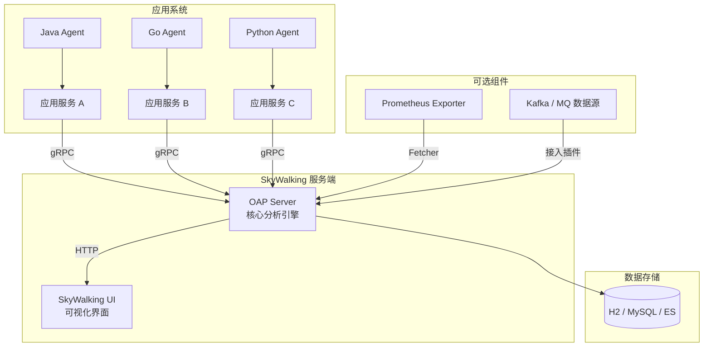

# 基础

> Apache SkyWalking 是一款开源的 APM（Application Performance Monitoring）+ 可观测性分析平台，专注于：
> 分布式链路追踪
>
> - 性能指标监控
> - 服务拓扑可视化
> - 服务/实例/端点级别的告警与分析
>
> 适用于 微服务、容器化、Service Mesh 和云原生架构。

## 核心功能

| 功能模块       | 说明                                 |
| ---------- | ---------------------------------- |
| 分布式链路追踪 | 自动记录跨服务的调用链（Trace）                 |
| 性能指标分析  | 记录响应时间、QPS、吞吐量、错误率等                |
| 服务拓扑图   | 展示服务之间的调用依赖关系                      |
| 告警系统    | 指标触发条件可配置报警                        |
| 日志（增强）  | 可选接入日志（与 Trace 相关联）                |
| 多协议支持   | 支持 HTTP/gRPC/MQ/Kafka/Service Mesh |
| 多语言探针   | Java、Node.js、Go、Python 等           |

## 关键概念

| 概念                | 说明                                       |
| ----------------- | ---------------------------------------- |
| **服务（Service）**   | 一个逻辑系统，比如 `user-service`、`order-service` |
| **实例（Instance）**  | 某个服务的部署副本，比如一台 Pod、一个 JVM 实例             |
| **端点（Endpoint）**  | 一个可观测的接口，比如 `/api/user/info`             |
| **Trace（链路）**     | 一次调用路径，如 A ➝ B ➝ C                       |
| **Span（跨度）**      | 一段具体操作，比如一次 DB 查询、一次 HTTP 请求             |
| **Segment**       | 某个实例中产生的一组 Span                          |
| **Metrics（指标）**   | 统计数据，如响应时间、TPS、错误率                       |
| **Topology（拓扑图）** | 服务之间的调用图关系                               |
| **Agent（探针）**     | 用于收集链路和指标的客户端工具（如 Java agent）            |
| **OAP（后端核心）**     | SkyWalking 的核心服务，接收 agent 数据，做分析         |
| **UI（前端页面）**      | Web 控制台，展示服务图谱、链路详情、指标面板等                |

## 常见端口

| 组件                 | 端口                 | 说明                          |
| ------------------ | ------------------ | --------------------------- |
| OAP                | `11800`            | gRPC，Agent 与 OAP 通讯         |
| OAP                | `12800`            | HTTP，UI 与 OAP 通讯、Metrics 拉取 |
| UI                 | `8080`（映射为如 18081） | Web 控制台页面                   |
| Prometheus Fetcher | 无默认端口（通过 OAP 拉取）   | 用于接入 Prometheus 数据源         |

## 架构

